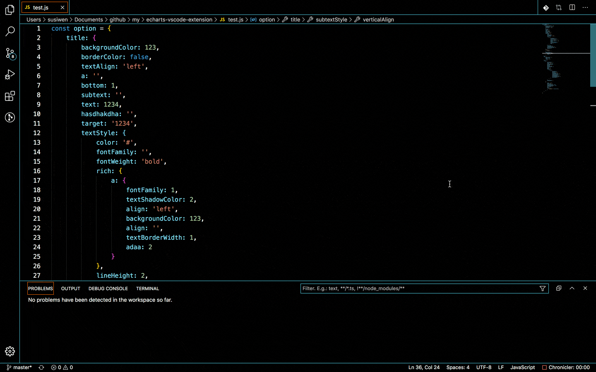

# echarts-vscode-extension

This is unofficial vscode extension for [Apache ECharts](https://github.com/apache/echarts)

## Install
* `ext install vscode-echarts-extension`
* Marketplace  

## Commands

This extension provides 2 commands

* `echarts.activate`: extension provides completion when matched case occur
* `echarts.deactivate`: extension never show completion

PS: From 0.1.2, extension won't provide completion at first, because JS file may not import `echarts`. User need to execute `echarts.activate` at command panel.

## Example

## Problems
* ~~All options information were received by ajax, useless when there were no Internet.~~ Cache response data (Update: json file store at local)
* ~~Due to Apache server response speed, sometime connection timeout.~~(Trying Netlify, but JSON files are so big and may have other known issues)(Update: json file store at local)
* ~~Use closest node to determine CompletionItem which sometime is inaccurate.~~ Solution: Use [acorn](https://github.com/acornjs/acorn) to generate AST and find closest node by using [acorn-walk](https://github.com/acornjs/acorn/tree/master/acorn-walk)
* ~~Don't support completion when object inside object~~ Find out all ancestors option
* All options must be in one root object (There is nothing I can do about it, it has to be :man_shrugging:)

## Suggestion
For the purpose of functionnality, I strongly recommend that putting echarts option object at seperated js file, and put options in same object.
(Actually, this will reduce losts of work, make my life much easy :stuck_out_tongue_winking_eye:)

## Documentation
Documentation generate from [here](https://github.com/susiwen8/incubator-echarts-doc/tree/api).

## TypeScript support
I want to thanks [David Sherret](https://github.com/dsherret) for doing an amazing project [ts-ast-viewer](https://github.com/dsherret/ts-ast-viewer). I have took the core function `getDescendantAtRange` to this project which can find out which node the cursor in.

## TODO
- [x] Downgrade
- [x] Optimization
- [x] Object inside Object ex. title.textStyle
- [ ] Replace Apache api (WIP, trying Netlify and reduce json file size)
- [x] base on option value type to provide helpful snippet text.
- [x] Check if type of value were correct.
- [x] Provide english documentation
- [ ] Provide chinese documentation
- [x] Convert HTML to Markdown (documentation)
- [x] Check if value were resonable.
- [ ] HoverProvider
- [x] More command
- [x] TypeScript support
- [ ] Add default value for option
- [ ] New option data structure